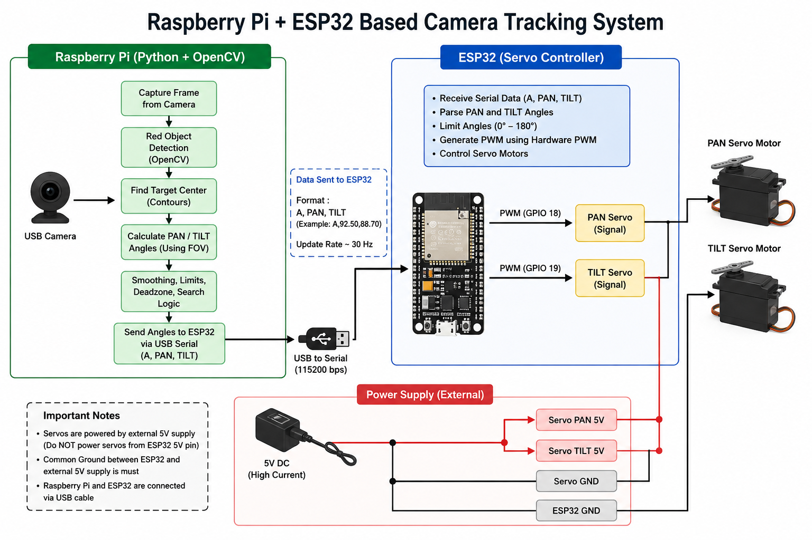

# ESP32 & Raspberry Pi Based Real-Time Camera Object Tracking System

A real-time camera tracking system built using a **Raspberry Pi, USB camera, ESP32, and two servo motors**. The Raspberry Pi performs image processing and target tracking using Python and OpenCV, while the ESP32 is dedicated to generating hardware PWM signals for controlling the PAN and TILT servo motors.

## 📌 Project Overview

The system uses a USB camera connected to the Raspberry Pi to detect and track a red-colored target.

The Raspberry Pi handles all the computational and tracking tasks, including:

* USB camera capture
* Red-object detection using OpenCV
* Target/contour detection
* Target center calculation
* PAN and TILT angle calculation
* Camera FOV-based angle correction
* Target smoothing
* Deadzone handling
* Servo movement limiting
* Target-lost detection
* Automatic search/scanning mode
* Real-time tracking display

The calculated PAN and TILT angles are then transmitted from the Raspberry Pi to the ESP32 through USB serial communication.

The ESP32 acts as a dedicated **servo controller**, receiving the angle commands and generating hardware PWM signals for the two servo motors.

## 🏗️ System Architecture

```text
                 ┌──────────────────────┐
                 │      USB Camera      │
                 └──────────┬───────────┘
                            │
                            ▼
              ┌──────────────────────────┐
              │      Raspberry Pi        │
              │   Python + OpenCV        │
              │                          │
              │ • Image Capture          │
              │ • Red Detection          │
              │ • Target Detection       │
              │ • Center Calculation     │
              │ • FOV Angle Calculation  │
              │ • Smoothing              │
              │ • Search / Tracking      │
              └────────────┬─────────────┘
                           │
                           │ USB Serial
                           │ 115200 baud
                           │
                           │ A,PAN,TILT
                           ▼
              ┌──────────────────────────┐
              │          ESP32           │
              │    Servo Controller      │
              │                          │
              │ • Serial Parsing         │
              │ • PAN PWM                │
              │ • TILT PWM               │
              └────────────┬─────────────┘
                           │
                  ┌────────┴────────┐
                  │                 │
                  ▼                 ▼
            ┌───────────┐     ┌───────────┐
            │ PAN Servo │     │ TILT Servo│
            └───────────┘     └───────────┘
                  ▲                 ▲
                  └────────┬────────┘
                           │
                     External 5V
                     Power Supply
```

## 📊 Block Diagram

The complete hardware and software architecture is shown below:

## 📊 System Block Diagram



## 🔄 Working Principle

### 1. Camera Input

A USB camera is connected directly to the Raspberry Pi. The Python program continuously captures frames from the camera.

### 2. Red Object Detection

The captured frame is converted from BGR to HSV color space. Two HSV ranges are used because red wraps around the HSV hue range.

The resulting mask is cleaned using filtering and morphological operations to remove noise.

### 3. Target Detection

Contours are extracted from the red mask. The program filters potential targets using:

* Area
* Aspect ratio
* Circularity

The best candidate is selected as the tracking target.

### 4. Target Position

The center coordinates of the detected target are calculated and compared with the center of the camera frame.

The tracking algorithm determines whether the target is:

* Left of the camera center
* Right of the camera center
* Above the camera center
* Below the camera center

### 5. PAN/TILT Angle Calculation

The pixel error between the target and frame center is converted into an angular error using the camera's field of view.

The current configuration uses:

```text
Horizontal FOV = 60°
Vertical FOV   = 45°
```

The calculated angle is then used to determine the required PAN and TILT servo positions.

### 6. Smooth Tracking

The system applies:

* Target smoothing
* Pixel deadzone
* Servo angle limits
* Maximum movement speed

This reduces servo jitter and prevents aggressive movements.

### 7. Raspberry Pi → ESP32 Communication

The Raspberry Pi sends the calculated servo positions to the ESP32 through USB serial communication at:

```text
Baud Rate: 115200
```

The command format is:

```text
A,PAN,TILT
```

Example:

```text
A,92.50,88.70
```

### 8. ESP32 Servo Control

The ESP32 receives the PAN and TILT values and generates the corresponding **hardware PWM signals** for the servo motors.

The ESP32 does not perform image processing or target detection. Its primary role is to provide reliable servo PWM control.

<h2>🎥 Project Demonstration</h2>

<p>
  <a href="project_demo.mp4">
    ▶️ Watch the Camera Tracking System Demo
  </a>
</p>

## ⚡ Power Architecture

The servo motors are powered using an **external regulated 5V power supply**.

The ESP32 is **not used to power the servo motors**.

```text
External 5V Supply
       │
       ├──────────► PAN Servo V+
       │
       └──────────► TILT Servo V+

External GND
       │
       ├──────────► PAN Servo GND
       ├──────────► TILT Servo GND
       └──────────► ESP32 GND
```

### Important

The external servo power supply and ESP32 must share a **common ground** so that the PWM control signals have a common reference.

## 🧩 Hardware Components

* Raspberry Pi
* USB Camera
* ESP32
* PAN Servo Motor
* TILT Servo Motor
* External regulated 5V power supply
* USB cable for Raspberry Pi ↔ ESP32 communication
* Servo mounting mechanism

## 💻 Software

### Raspberry Pi

* Python 3
* OpenCV
* NumPy
* PySerial

### ESP32

* Arduino IDE
* ESP32 board package
* ESP32Servo library

## 📁 Project Structure

```text
camera-tracking-system/
│
├── RWS.py
├── esp_1_.ino
├── Block_diagram.png
└── README.md
└── demo_video.mp4
```

## 🎮 Raspberry Pi Controls

The Python tracking application provides keyboard controls:

| Key | Function                |
| --- | ----------------------- |
| `Y` | Enable/disable tracking |
| `C` | Center PAN/TILT servos  |
| `Q` | Quit application        |

## ⚙️ Main Tracking Parameters

The Raspberry Pi tracking software includes configurable parameters for:

```text
Camera Resolution      : 640 × 480
Camera FPS              : 30
Serial Baud Rate        : 115200
Horizontal FOV          : 60°
Vertical FOV            : 45°
PAN Range               : 0° – 180°
TILT Range              : 0° – 180°
Target Deadzone         : 6 pixels
Search Speed            : 35°/s
```

These values can be adjusted according to the camera, servo motors, mounting mechanism, and operating environment.

## 🚀 How It Works

```text
USB Camera
     ↓
Raspberry Pi
     ↓
Capture Image
     ↓
Detect Red Target
     ↓
Find Target Center
     ↓
Calculate Pixel Error
     ↓
Convert Pixel Error → Angle
     ↓
Smooth & Limit Movement
     ↓
Send PAN/TILT over USB Serial
     ↓
ESP32
     ↓
Hardware PWM
     ↓
PAN + TILT Servo Motors
     ↓
Camera Reorients Toward Target
```

## 🔌 Communication Protocol

The communication between Raspberry Pi and ESP32 uses a simple text-based protocol.

### Raspberry Pi sends

```text
A,90.00,90.00
```

where:

```text
A    = Angle command
90.00 = PAN angle
90.00 = TILT angle
```

The ESP32 parses these values and updates the corresponding servo positions.

## 🎯 Features

* Real-time red-object tracking
* Raspberry Pi-based computer vision
* OpenCV image processing
* FOV-based PAN/TILT correction
* Smooth servo movement
* Deadzone for reduced jitter
* Automatic target reacquisition
* Left-right search when target is lost
* Hardware PWM servo control using ESP32
* External servo power supply
* Raspberry Pi and ESP32 distributed architecture

## 📌 Important Safety Note

Do **not** power the servo motors directly from an ESP32 GPIO pin.

Use a suitable external 5V supply capable of providing the required servo current. Connect the external supply ground to the ESP32 ground.

## 📜 License

This project can be used and modified for educational, research, and personal development purposes. 
